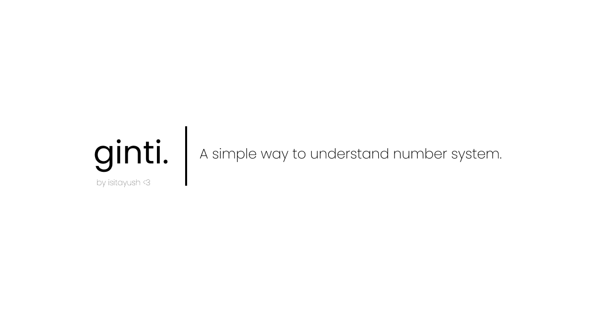

### ginti.

A simple way to understand the number system. This project is a fun
implementation of most commonly used number systems in information theory.
I made this project with the goal to provide an easier visualization of the
underlying number systems. ginti. includes,
- Binary | Base: 2 | Usage: Most commonly used in computer science to represent any information. | Range: 0-1
- Octal | Base: 8 | Usage: This is used in Unix file permissions. | Range: 0-7
- Decimal | Base: 10 | Usage: Most commonly used number system. | Range: 0-9
- Hexadecimal | Base: 16 | Usage: Used in web development to represent colors. | Range: 0-9, A-F

Yeah! **It's just counting in different bases**. A base is the total
number of values a digit can have. For example, in decimal, each digit can have
10 values (0-9), so the base is 10. In binary, each digit can have 2 values
(0-1), so the base is 2.

The best real life analogy to understand number systems is to think of a 4-digit padlock.
The lock has a fixed number of digits (4) but each digit can be anything from 0-9.
The number system is the same, but the number of digits and the number of values each
digit can have changes.

This project visuliazes this very concept.

### How to use?

Just visit the app and play around!

### License

It's MIT. Do whatever you want with it. If you like it, give me a shoutout on
Twitter [@is_it_ayush](https://twitter.com/is_it_ayush). Here's the [license](./LICENSE.md)
in case you still want to read it.
